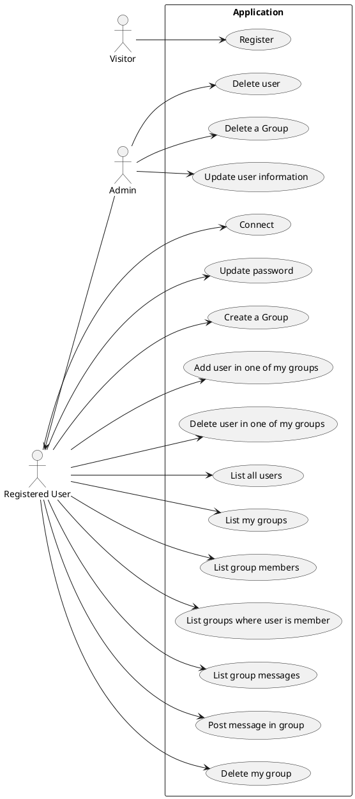
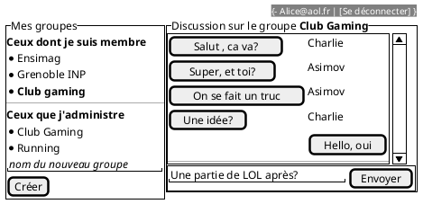
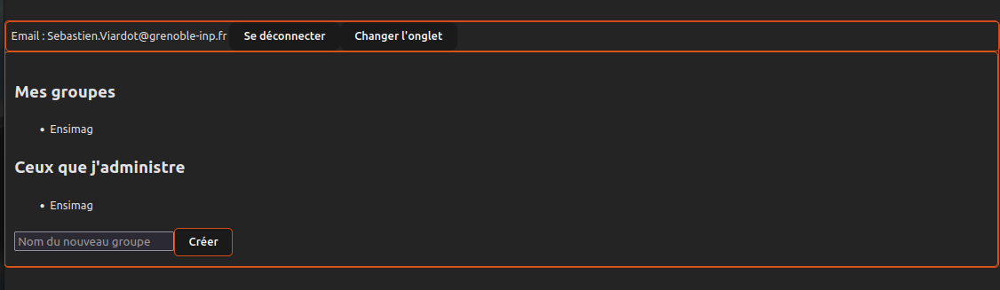
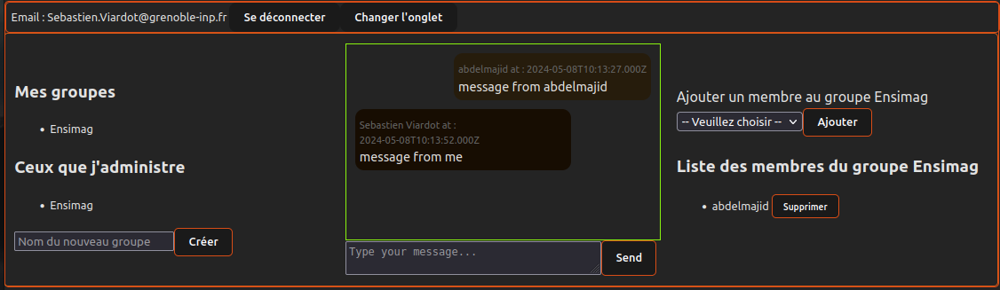
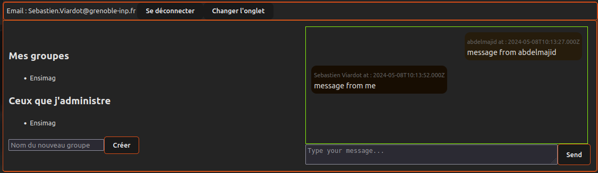
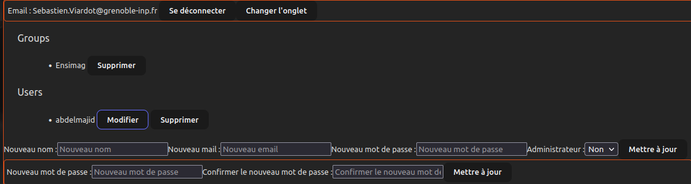
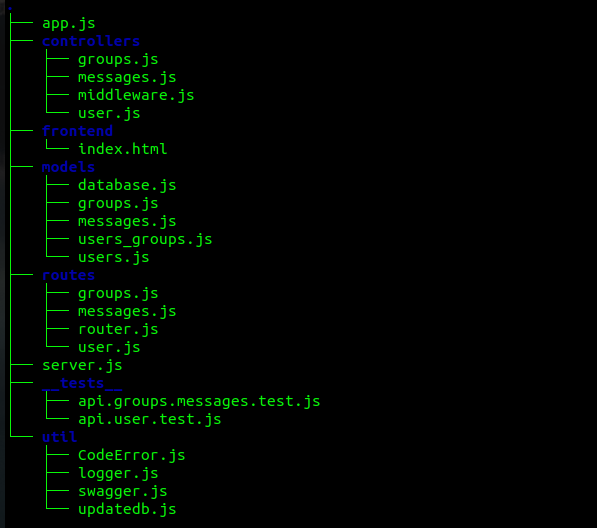
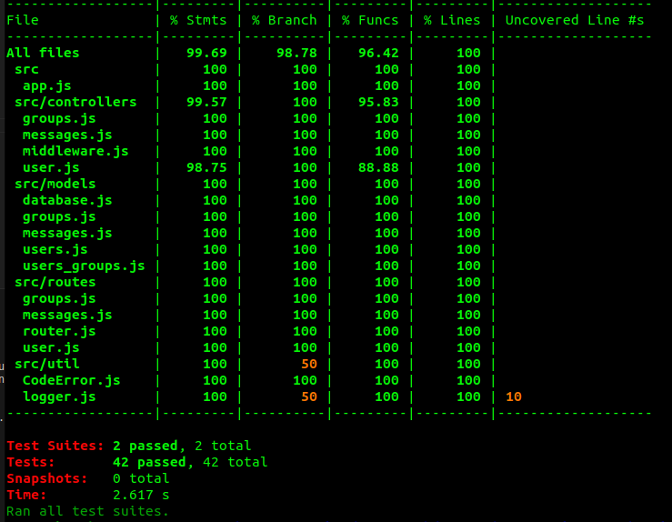

---
title: Projet React 
author:  
- Abdelmajid AIT OUAKRIM
--- 

## Cahier des charges

Ici vous décrivez les fonctionnalités souhaitées et celles effectivement mises en oeuvre. Avec un diagramme UML des cas d'usage et des maquettes des vues souhaitées et des captures d'écran de ce qui a été réalisé.

### Cas d'usage




### Maquettes



### Captures d'écran

- Vue d'accueil

- Vue après avoir cliqué sur un groupe de "Ceux que j'administre"

- Vue après avoir cliqué sur un groupe "Mes groupes"

- Vue après avoir cliqué sur le bouton "Changer l'onglet" et ensuit le bouton "Modifier" pour modifier les informations de Abdelmajid


### API mise en place

Veuillez vous référer à [la documentation swagger](https://imachat.osc-fr1.scalingo.io/doc) pour obtenir une description détaillée de l'API

## Architecture du code

### FrontEnd
#### IMaChat - Frontend
    ImaChat est une application de messagerie frontend construite avec React. Elle permet aux utilisateurs de créer des groupes, d'envoyer des messages et de gérer les utilisateurs et les groupes s'ils sont administrateurs.

#### Composants

  Le code frontend est organisé en composants situés dans le répertoire `components/` :
    - Form.jsx : Composant chargé d'afficher la page de `Login` et `Register`
    - Home.jsx : Composant principal pour la page d'accueil.
    - Groups.jsx : Composant chargé d'afficher les groupes d'utilisateurs.
    - Administrateur.jsx : Composant pour la gestion des utilisateurs et des groupes par les administrateurs.
    - Messages.jsx : Composant pour afficher et envoyer des messages dans un groupe.
    - CreateGroup.jsx : Composant pour créer un nouveau groupe.
    - DeleteAddMember.jsx : Composant pour supprimer ou ajouter des membres à un groupe.
    - UpdateInformation.jsx : Composant pour mettre à jour les informations utilisateur par les administrateurs.
    - Utile.js : Contient des fonctions utilitaires partagées telles que les constantes DNS et les fonctions de validation.

#### Utilitaires

    Les fonctions utilitaires partagées sont situées dans le fichier `utils.js` :

   

#### Styles

    Les styles CSS se trouvent dans le répertoire `views/`, organisés par composant.

## Backend

#### Schéma de votre base de donnée

```plantuml
class User {
  + id: integer <<PK>>
  name: string
  email: string
  passhash: string
  isAdmin: boolean
}

class Message {
  + id: integer <<PK>>
  content: string
  createdAt: time
  + userId: integer <<FK>>
  + groupId: integer <<FK>>
}

class Group {
  + id: integer <<PK>>
  name: string
  + ownerId: integer <<FK>>
}

class Users_Groups {
  + memberId: integer <<PK, FK>>
  + groupId: integer <<PK, FK>>
}

User "1" -- "n" Message : posts
Group "1" -- "n" Message : contains

User "n" -- "n" Group : is member 
User "1" -- "n" Group : create and own
Users_Groups "n" -- "n" User : members
Users_Groups "n" -- "n" Group : groups

```

#### Architecture de votre code
- organisation de code en `.src/`
  
- les Choix pour le backend :
   * Organisation en modules distincts pour les contrôleurs, les routes, les modèles de données et les utilitaires, pour une meilleure séparation des préoccupations.
   * nclusion de tests unitaires et d'intégration pour garantir le bon fonctionnement des fonctionnalités de l'application.
   * Configuration de Swagger pour générer une documentation interactive de l'API.
   * Utilisation de Sequelize pour simplifier l'interaction avec la base de données relationnelle.
  
### Gestion des rôles et droits

Expliquer ici les différents rôles mis en place, et comment ils sont gérés dans votre code.

- Coté backend
  - Administrateur: Un administrateur a des droits étendus sur l'application, y compris la gestion des utilisateurs, des groupes. Les administrateurs sont capables de créer, modifier et supprimer des utilisateurs et des groupes.
  - Utilisateur Standard: Les utilisateurs standard ont des droits limités par rapport aux administrateurs. Ils peuvent généralement consulter les données de l'application et effectuer des actions de base, telles que la création de messages et la gestion de leur propre compte. et leur propres groupes
  
  La gestion des rôles côté backend repose principalement sur la propriété booléenne `isAdmin` associée à chaque utilisateur, ce qui détermine s'il possède des privilèges d'administrateur (root) ou non.

- Coté frontend
  
  les rôles de cote backend  sont également pris en compte pour afficher ou masquer certaines fonctionnalités en fonction du type d'utilisateur connecté.

  - Interface Administrateur : Lorsqu'un administrateur est connecté, il voit généralement un tableau de bord complet avec des fonctionnalités avancées telles que la gestion des utilisateurs et des groupes.

  - Interface Utilisateur Standard: Les utilisateurs standard voient une interface plus restreinte qui leur permet de consulter les messages, d'envoyer des messages et de gérer leur propre compte et leur propres groupes mais sans accès aux fonctionnalités d'administration.
  
  La gestion des rôles dans le frontend est principalement réalisée à l'aide de la logique de rendu conditionnel et des contrôles d'accès au niveau des composants. Par exemple, nous utilisons des directives conditionnelles dans les templates pour afficher ou masquer certains éléments en fonction du rôle de l'utilisateur connecté.

## Test

### Backend

Ce dépôt contient une série de tests automatisés pour évaluer le comportement de l'API backend dans divers scénarios. Les tests sont réalisés à l'aide de Jest et Supertest.

#### Description des Tests_Users

    Authentification des Utilisateurs
    - Test de Connexion avec des Identifiants Invalides : Vérifie si l'API rejette les tentatives de connexion avec des identifiants incorrects.
    - Test de Connexion avec des Identifiants Validess : Évalue si l'API accepte les identifiants valides et délivre un token d'authentification.
    - Test de Connexion sans Token : Vérifie si l'API répond correctement lorsqu'aucun token d'authentification n'est fourni.

    Inscription des Utilisateurs
    - Test d'Inscription avec des Données Invalides : Vérifie si l'API rejette les tentatives d'inscription avec des données incorrectes.
    - Test d'Inscription avec une Adresse E-mail Déjà Existante : Évalue si l'API empêche l'inscription avec une adresse e-mail déjà utilisée.
    - Test d'Inscription Réussie : Vérifie si l'API permet l'inscription avec des informations valides.

    Récupération des Utilisateurs
    - Test de Récupération des Utilisateurs : Vérifie si l'API renvoie correctement la liste des utilisateurs, uniquement aux utilisateurs authentifiés.

    Mise à Jour des Utilisateurs
    - Test de Mise à Jour des Informations Utilisateur : Évalue si l'API permet aux utilisateurs de mettre à jour leurs informations (roots), y compris leur mot de passe.(normal user)

    Suppression des Utilisateurs
    - Test de Suppression d'Utilisateurs : Vérifie si l'API permet la suppression des utilisateurs, tout en empêchant les utilisateurs non autorisés de supprimer des comptes.

    Gestion des Erreurs et Exceptions
    - Test de Gestion des Erreurs : Évalue la capacité de l'API à gérer correctement les erreurs et les cas exceptionnels.
  
#### Description des Tests_Groups_Messages

    Gestion des Groupes et les Messages
    - Création de Groupe : Vérifie si l'API permet la création de nouveaux groupes.
    - Création de Groupe avec Nom Invalide : Évalue la réponse de l'API lors de la tentative de création d'un groupe avec un nom invalide.
    - Liste des Groupes Créés par l'Utilisateur : Vérifie si l'API renvoie la liste des groupes créés et gérés par l'utilisateur.
    - Ajout d'Utilisateur à un Groupe : Évalue la capacité de l'API à ajouter un utilisateur à un groupe existant.
    - Ajout d'Utilisateur Invalide à un Groupe : Vérifie la réponse de l'API lors de la tentative d'ajout d'un utilisateur invalide à un groupe.
    - Liste des Membres d'un Groupe : Vérifie si l'API renvoie la liste des membres d'un groupe spécifique.
    - Liste des Groupes d'un Utilisateur : Évalue si l'API renvoie la liste des groupes auxquels un utilisateur est membre.
    - Envoi de Message à un Groupe : Vérifie si l'API permet l'envoi de messages à un groupe spécifique.
    - Envoi de Message non Valide : Évalue la réponse de l'API lors de la tentative d'envoi d'un message non valide.
    - Liste des Messages d'un Groupe : Vérifie si l'API renvoie la liste des messages d'un groupe spécifique.
    - Suppression d'Utilisateur d'un Groupe : Vérifie si l'API permet à un administrateur de supprimer un membre d'un groupe.
    - Suppression d'Utilisateur Invalide d'un Groupe : Évalue la réponse de l'API lors de la tentative de suppression d'un utilisateur invalide d'un groupe.
    - Suppression de Groupe par un Administrateur : Vérifie si l'API permet à un administrateur de supprimer un groupe.
    - Récupération de tous les Groupes : Évalue si l'API renvoie la liste complète de tous les groupes.

  #### Exécution des Tests
  ```bash
  cd ./backend
  npm install
  npm run startdev &
  npm test
  ```
  #### Couverture
  
### Frontend

    Connexion Utilisateur

    - Test de connexion réussie : Vérifie si un utilisateur peut se connecter avec des identifiants valides.
    - Test de connexion échouée : Vérifie si un message d'erreur est affiché en cas d'identifiants invalides.

    Enregistrement Utilisateur

    - Affichage du formulaire d'enregistrement : Vérifie si le formulaire d'enregistrement s'affiche correctement avec tous les champs nécessaires.
    - Gestion des erreurs : Vérifie si des messages d'erreur appropriés sont affichés pour les entrées invalides, tels que des emails incorrects, des mots de passe trop courts, ou des mots de passe non correspondants.
  
    Gestion des Groupes

    - Création de Groupes : Teste la création de nouveaux groupes par un utilisateur connecté.
    - Affichage des Groupes de l'Utilisateur : Affiche les groupes dont l'utilisateur est administrateur ainsi que les groupes dont l'utilisateur est membre uniquement.
    - Membres des Groupes : Obtient la liste des membres des groupes dont l'utilisateur est administrateur.
    - Liste des Utilisateurs Ajoutables : Affiche la liste des utilisateurs que l'administrateur du groupe peut ajouter à ses groupes.
    - Envoi de Messages : Vérifie si un utilisateur peut envoyer des messages dans un groupe existant.
    - Messages des Groupes : Obtient les messages des groupes auxquels l'utilisateur est membre.
    - Ajout/Suppression Utilisateurs : Teste l'ajout et la suppression d'utilisateurs dans un groupe par un admin du groupe.
    - Suppression de Groupes : Vérifie si un administrateur du groupe peut supprimer un groupe.

    Mise à Jour du Mot de Passe

    - Mise à Jour du Mot de Passe : Vérifie si un utilisateur peut mettre à jour son mot de passe avec succès.

    Mise à Jour des Informations Utilisateur

    - Mise à Jour des Informations : Teste la capacité d'un administrateur à mettre à jour les informations d'un utilisateur, telles que le nom, l'email, le mot de passe et le statut d'administrateur.

    Suppression d'Utilisateurs et de Groupes

    - Suppression d'Utilisateurs et de Groupes : Vérifie si un administrateur peut supprimer un utilisateur et un groupe.
  
    Les tests frontend avec Cypress offrent une couverture maximale des fonctionnalités essentielles de l'application ImaChat.

  #### Exécution des tests
  ```bash
  cd ./frontend
  npm install
  npm install cypress --save-dev
  npm run dev &
  npx cypress run
  ```
## Intégration + déploiement (/3)

Les différentes étapes configurées dans le fichier `.gitlab-ci.yml` :

#### backend_tests

Cette étape consiste à exécuter les tests du backend. Les actions suivantes sont effectuées :

- Installation des dépendances du backend.
- Mise à jour de la base de données.
- Génération de la documentation de l'API.
- Exécution des tests backend.
- Stockage des résultats des tests dans un fichier `backend-report.txt`.

#### pages

Cette étape déploie le frontend de production sur les pages du projet. Les actions suivantes sont effectuées :

- Installation des dépendances du frontend.
- Construction du frontend et génération des fichiers de production.
- Copie des fichiers de production dans le répertoire `public`.
- Conservation des fichiers du répertoire `public` comme artefacts.

#### scalingo

Cette étape déploie le backend et le frontend sur Scalingo. Les actions suivantes sont effectuées :

- Configuration de l'application pour utiliser le répertoire backend.
- Génération de clés SSH temporaires et ajout à Scalingo pour le déploiement.
- Ajout, commit et push du frontend vers le dépôt Scalingo.
- Suppression des clés SSH temporaires après le déploiement.

#### jobcypress

Cette étape lance les tests Cypress pour le frontend. Les actions suivantes sont effectuées :

- Exécution des tests Cypress.
- Stockage des résultats des tests dans un fichier `report-cypress.txt`.

#### generate_badges

Cette étape génère des badges pour les tests backend et frontend :

- Génération de badges à l'aide du script `badges.sh`.
- Conservation des badges comme artefacts.


## Installation
```bash
  git clone <url de ce dépôt> imachat
  cd imachat/backend
  npm install # Assurez que npm est déjà installé
  npm start & # Le serveur écoute maintenant sur le port 3000
  cd ../frontend
  # Accédez au fichier ./src/components/Util.js et changez DNS par http://127.0.0.1:3000
  npm install
  npm run dev & 
  # Maintenant, l'application web est disponible pour tout le monde à l'adresse http://{adresse_ip_de_la_machine}/5173/
  # Avant de héberger l'application sur la machine, îl faut  prendre en compte les défis de sécurité
```